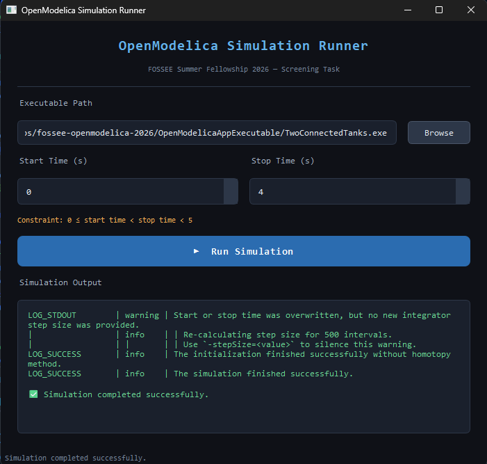

# OpenModelica Simulation Runner

A desktop GUI application built with **Python + PyQt6** to launch OpenModelica-compiled simulation executables with configurable start and stop times.

Built as part of the **FOSSEE Summer Fellowship 2026** screening task — OpenModelica project.

---

## Demo



---

## Features

- Browse and select any OpenModelica-compiled `.exe`
- Set start and stop time with enforced constraint: `0 ≤ start < stop < 5`
- Runs simulation in a **background thread** — GUI stays responsive during execution
- Passes simulation parameters correctly using runtime flags (-startTime, -stopTime)
- Live output streaming to a terminal-style console
- Input validation with clear and descriptive error dialogs 
- Status bar feedback throughout execution (Ready → Running → Completed/Failed)
- Graceful handling of execution errors (invalid path, permission issues, runtime failures)

---

## Project Structure

```
fossee-openmodelica-2026/ 
├── executable/     # Compiled OpenModelica executable 
├── gui/            # PyQt6 GUI application 
├── README.md 
├── LICENSE 
└── .gitignore
```

---

## Requirements

- Python 3.6+
- PyQt6
- OpenModelica 1.26.3 (Windows 64-bit)
- Windows 10/11

---

## Installation

### 1. Install Python dependencies

```bash
pip install PyQt6
```

### 2. Install OpenModelica

Download and install **OpenModelica 1.26.3 (64-bit)** from the official website:
https://openmodelica.org/download/download-windows/

### 3. Copy required DLL files

The simulation executable depends on runtime DLL libraries that ship with OpenModelica. Since these files exceed GitHub's file size limits, they are not included in this repository and must be copied manually.

After installing OpenModelica, run the following command in **Command Prompt**:

```
copy "C:\Program Files\OpenModelica1.26.3-64bit\bin\*" "<path-to-repo>\OpenModelicaApp\executable\"
```

Replace `<path-to-repo>` with the path where you cloned this repository. For example:

```
copy "C:\Program Files\OpenModelica1.26.3-64bit\bin\*" "C:\Users\YourName\fossee-openmodelica-2026\OpenModelicaApp\executable\"
```

---

## Usage

```bash
cd gui
python app.py
```

1. Click **Browse** and navigate to `OpenModelicaApp/executable/TwoConnectedTanks.exe`
2. Set **Start Time** (0–3) and **Stop Time** (1–4), ensuring `start < stop < 5`
3. Click **▶ Run Simulation**
4. View live output in the console panel

---

## Model: TwoConnectedTanks

The `TwoConnectedTanks` model is part of the `NonInteractingTanks` package provided by FOSSEE. It simulates fluid flow dynamics between two connected tanks with different initial liquid levels.

The model was compiled using **OMEdit** (OpenModelica Connection Editor) v1.26.3 on Windows 11.

The executable accepts simulation parameters using dedicated runtime flags:

```bash
TwoConnectedTanks.exe -startTime=0 -stopTime=4
```

Reference: [OpenModelica Simulation Flags Documentation](https://openmodelica.org/doc/OpenModelicaUsersGuide/latest/simulationflags.html#simflag-override)

---

## Design Decisions

**Two-class OOP structure:**
- `SimulationRunner` — manages the entire GUI (window, widgets, layout, user interaction)
- `SimulationWorker` — handles execution of the simulation in a separate `QThread`

Separating these two concerns means UI logic and execution logic never interfere with each other, making the code easier to maintain and extend.

**Why QThread?**
Without threading, running the executable would block the main GUI thread — the window would freeze until the simulation completes. Running it in a `QThread` keeps the interface fully responsive and allows output to stream in live via `pyqtSignal`.

**Input validation:**
All edge cases are caught before execution — missing file, non-existent path, and invalid time range — with descriptive error dialogs so the user always knows what went wrong.

---

## Author

Paras Pitu Wadkar
24BCE10421
VIT Bhopal University
FOSSEE Summer Fellowship 2026 Applicant